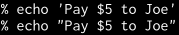
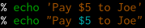
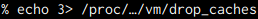
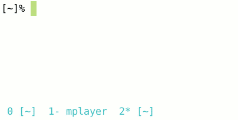

# My config files for Linux

**My Configuration as a Linux User**

Take a look -> Understand what means -> Copy what you want to your folder

<!-- vim-markdown-toc GFM -->

* [zsh](#zsh)
	* [Installation](#installation)
	* [Configure zsh](#configure-zsh)
	* [zsh alias](#zsh-alias)
* [ranger](#ranger)
* [fzf](#fzf)
	* [Using Homebrew](#using-homebrew)
	* [Using git](#using-git)
	* [Using Linux package managers](#using-linux-package-managers)
* [zsh-syntax-highlighting](#zsh-syntax-highlighting)
	* [Installation Guide](#installation-guide)
* [incr.zsh](#incrzsh)

<!-- vim-markdown-toc -->

## zsh

### Installation

- **Install `zsh` `curl` `git` first**

_Ubuntu/Debian_

```bash
sudo apt-get install zsh curl git
```

_Arch Linux_

```bash
sudo pacman -S zsh curl git
```

- Install oh-my-zsh

```bash
sh -c "$(curl -fsSL https://raw.github.com/ohmyzsh/ohmyzsh/master/tools/install.sh)"
```

OR

```bash
sh -c "$(wget https://raw.github.com/ohmyzsh/ohmyzsh/master/tools/install.sh -O -)"
```

### Configure zsh

- git clone this project & cd

```bash
git clone https://github.com/zhzhzhy/.config
cd .config
```

- Copy files under `zsh` OR `zsh-Termux` to `$HOME/.config/zsh/`

```bash
cp -i -R ./zsh $HOME/.config/
```

- Copy `.zshrc` to `$HOME`

```bash
cp -i $HOME/.config/zsh/.zshrc $HOME/
```

### zsh alias

```bash
alias ra='ranger'
alias ta='tmux a'
alias t='tmux'
alias gs='git config credential.helper store'
alias gcl='git clone'
alias gsh='git push'
alias gll='git pull'
alias gad='git add .'
alias gco='git commit -m'
alias gst='git status'
alias gbr='git branch'
alias gch='git checkout'
alias grb='git rebase -i'
alias gmr='git merge'
alias gcp='git cherry-pick'
alias grf='git reflog'
alias gl='git log --graph'
alias glo='git log --graph --oneline'
alias glod='git log --graph --oneline --decorate'
alias gr='git remote'
alias ex='exit'
alias l='ls -al'
alias sudo='sudo -E'
```

## ranger

- Available addtional commands:
  `:paste_as_root` `:toggleVCS` `:mkcd` `:fzf_select` `:compress` `:extracthere`

- Copy ranger config files into $HOME/.config/ranger

```bash
cp -i -R ./ranger $HOME/.config/
```

- Compress and extract archives: <br>
  `:compress` `:extracthere` depends on atool

  **Atool installation**

_Arch Linux_:

```bash
sudo pacman -S atool
```

_Ubuntu_:

```bash
sudo apt install atool
```

## fzf

**fzf is a general-purpose command-line fuzzy finder**

- **fzf Installation**

fzf project consists of the following components:

- `fzf` executable
- `fzf-tmux` script for launching fzf in a tmux pane
- Shell extensions
  - Key bindings (`CTRL-T`, `CTRL-R`, and `ALT-C`) (bash, zsh, fish)
  - Fuzzy auto-completion (bash, zsh)
- Vim/Neovim plugin

You can [download fzf executable][bin] alone if you don't need the extra
stuff.

[bin]: https://github.com/junegunn/fzf/releases

### Using Homebrew

You can use [Homebrew](http://brew.sh/) (on macOS or Linux)
to install fzf.

```sh
brew install fzf

# To install useful key bindings and fuzzy completion:
$(brew --prefix)/opt/fzf/install
```

fzf is also available [via MacPorts][portfile]: `sudo port install fzf`

[portfile]: https://github.com/macports/macports-ports/blob/master/sysutils/fzf/Portfile

### Using git

Alternatively, you can "git clone" this repository to any directory and run
[install](https://github.com/junegunn/fzf/blob/master/install) script.

```sh
git clone --depth 1 https://github.com/junegunn/fzf.git ~/.fzf
~/.fzf/install
```

### Using Linux package managers

| Package Manager | Linux Distribution      | Command                            |
| --------------- | ----------------------- | ---------------------------------- |
| APK             | Alpine Linux            | `sudo apk add fzf`                 |
| APT             | Debian 9+/Ubuntu 19.10+ | `sudo apt-get install fzf`         |
| Conda           |                         | `conda install -c conda-forge fzf` |
| DNF             | Fedora                  | `sudo dnf install fzf`             |
| Nix             | NixOS, etc.             | `nix-env -iA nixpkgs.fzf`          |
| Pacman          | Arch Linux              | `sudo pacman -S fzf`               |
| pkg             | FreeBSD                 | `pkg install fzf`                  |
| pkg_add         | OpenBSD                 | `pkg_add fzf`                      |
| XBPS            | Void Linux              | `sudo xbps-install -S fzf`         |
| Zypper          | openSUSE                | `sudo zypper install fzf`          |

> :warning: **Key bindings (CTRL-T / CTRL-R / ALT-C) and fuzzy auto-completion
> may not be enabled by default.**
>
> Refer to the package documentation for more information. (e.g. `apt-cache show fzf`)

## zsh-syntax-highlighting

see [https://github.com/zsh-users/zsh-syntax-highlighting](https://github.com/zsh-users/zsh-syntax-highlighting)

Fish shell-like syntax highlighting for Zsh.

Some examples:

Before: [](images/before1.png)
<br/>
After:&nbsp; [](images/after1.png)

Before: [](images/before2.png)
<br/>
After:&nbsp; [](images/after2.png)

Before: [](images/before3.png)
<br/>
After:&nbsp; [](images/after3.png)

Before: [](images/before4-smaller.png)
<br/>
After:&nbsp; [](images/after4-smaller.png)

### Installation Guide

see [https://github.com/zsh-users/zsh-syntax-highlighting/blob/master/INSTALL.md](https://github.com/zsh-users/zsh-syntax-highlighting/blob/master/INSTALL.md)

## incr.zsh

see [https://mimosa-pudica.net/zsh-incremental.html](https://mimosa-pudica.net/zsh-incremental.html)


